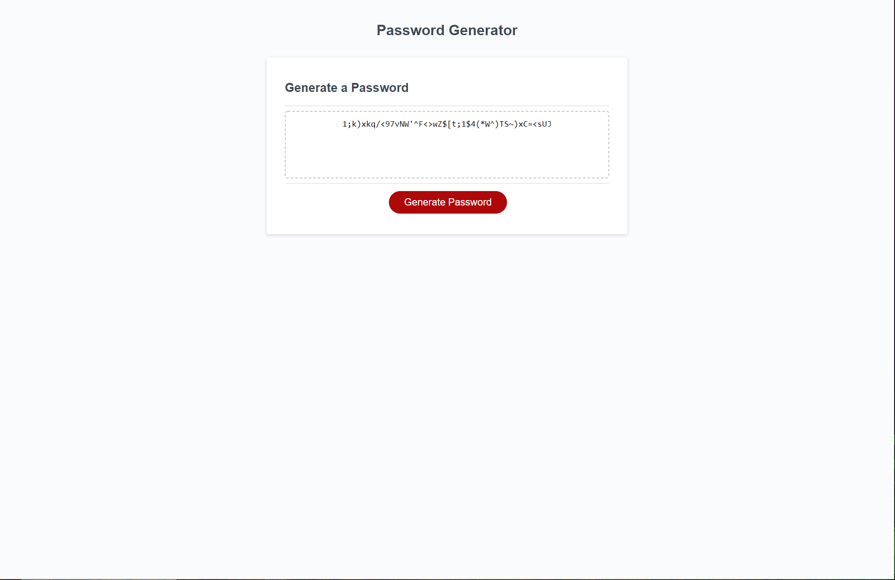

#  Random Password Generator

 https://obtains.github.io/Password-Generator/

 Created variables inputs for needed functions such as special characters, upper/lower case letters, and numbers.

 Created functions with prompts to properly create a random password depending on the user.

 Added the password so it  will show in the text box.

 Created randomizer so each password will differ from another based on what prompts were awnsered.

  